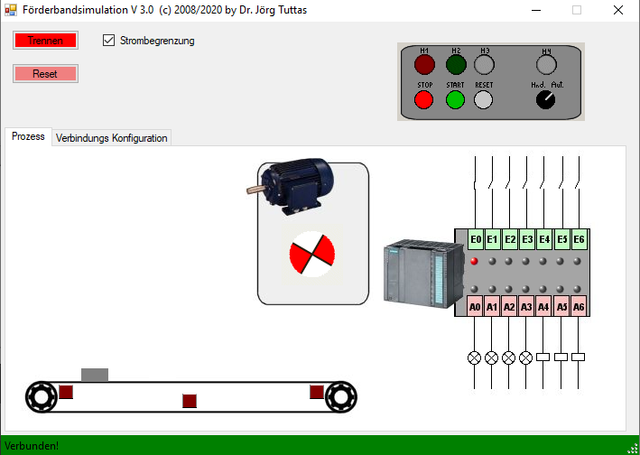

# Virtuelles Prozessmodell Förderband
Ein Virtuelles Prozessmodell, welches angeschlossen werden kann an.
- Modbus
- CoDeSys
- FluidSim

##Download
You can download the Application here [setup.exe](https://service.joerg-tuttas.de/CBasicModel/setup.exe)
## I/O Belegung
### Modbus Belegung 
Die Eingänge sind hier mit (Ausgangs-) Coils verbunden, da diese nur über Modbus zu lesen sind.
| Signal  | Belegung  | Kommentar  |
|:-:|---|---|
| E_Stop  | %QX4.0  | neg. Logik  |
| E_Start  | %QX4.1  |   |
| E_Reset  | %QX4.2  |   |
| E_Hand_Autom.  | %QX4.3  | Schalter  |
| E_Links | %QX4.4  |   |
| E_Rechts  | %QX4.5  |   |
| E_Drehm.  | %QX4.6  |   |
| A_H1  | %QX5.0  |   |
| A_H2  | %QX5.1  |   |
| A_H3  | %QX5.2  |   |
| A_H4  | %QX5.3  |   |
| A_Motor_links  | %QX5.4  |   |
| A_Motor_rechts  | %QX5.5  |   |
| A_Motor_speed  | %QX5.0  | Motor bewegt sich mit doppelter Geschwindigkeit  |
## Video